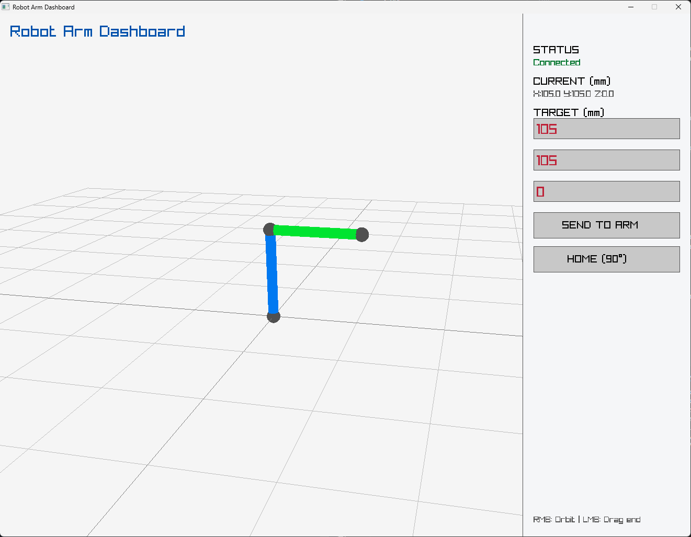
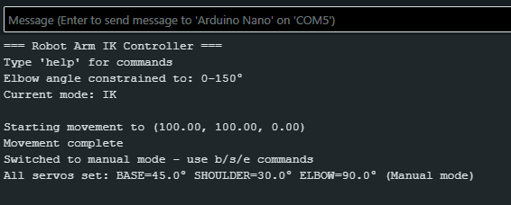

# 3-DOF Robot Arm with Inverse Kinematics

A 3-degree-of-freedom robotic manipulator with real-time inverse kinematics, featuring smooth interpolated movements and an interactive 3D control dashboard. The system combines custom IK algorithms on Arduino with a visual C++/Raylib interface for intuitive control and monitoring.

<p align="center">
  
</p>

## Overview

This project implements a complete robot arm control system with two main components:

1. **Arduino Firmware**: Real-time inverse kinematics engine that converts 3D coordinates to joint angles and controls servos with smooth interpolation
2. **Desktop Dashboard**: Interactive 3D visualization built with Raylib that allows drag-and-drop positioning and real-time monitoring

**Key Achievement**: Successfully implemented geometric IK solution achieving ±2mm positioning accuracy across a 210mm workspace with seamless PC-to-robot serial communication.

## Features

### Arduino IK Engine
- **Custom Inverse Kinematics**: Geometric solution using law of cosines and triangle decomposition for 3-DOF manipulation
- **Smooth Linear Interpolation**: Cartesian-space path planning with 20-step interpolation for fluid movement
- **Dual Control Modes**: 
  - **IK Mode**: Position control via 3D coordinates (x, y, z)
  - **Manual Mode**: Direct servo angle control for testing and diagnostics
- **Safety Systems**: 
  - Workspace boundary validation
  - Self-collision prevention via elbow angle constraints
  - Per-servo calibration for accurate positioning
- **Real-time Serial Interface**: Command-line control via USB at 115200 baud
- **Memory-Optimized Code**: Runs on Arduino Uno/Nano with only 2KB RAM
- **Non-blocking Architecture**: Timing-based servo updates maintain interface responsiveness during motion

### Desktop Control Dashboard
- **Interactive 3D Visualization**: Real-time rendering of robot arm configuration
- **Drag-and-Drop Control**: Click and drag the end effector to position the arm
- **Coordinate Input**: Precise positioning via numerical X/Y/Z input fields
- **Live Status Display**: Current position feedback and serial connection status
- **Camera Controls**: Orbit view with right-click for inspection from any angle
- **Direct Hardware Communication**: Sends coordinates to physical arm via serial


## Hardware

### System Components
| Component | Model/Spec | Purpose |
|-----------|------------|---------|
| Microcontroller | Arduino Nano (ATmega328) | Main controller (16MHz, 32KB flash, 2KB RAM) |
| Servo Driver | PCA9685 16-Channel PWM | I²C servo control with 12-bit resolution |
| Actuators | 3× MG996R Servos | High-torque metal gear servos (180° rotation) |
| Power Supply | 5V/3A Regulated | External servo power (critical: servos draw 2.5A each under load) |
| Structure | Custom segments | 3D printed arm linkages |

### Physical Specifications
- **Shoulder Segment (L1)**: 105mm
- **Forearm Segment (L2)**: 105mm  
- **Maximum Reach**: 210mm (L1 + L2)
- **Workspace**: Hemispherical sector, 210mm radius
- **Base Rotation Range**: 0° to 180°
- **Degrees of Freedom**: 3 (Base, Shoulder, Elbow)

### System Architecture
```
┌──────────────────┐         Serial USB
│   PC Dashboard   │◄──────────────────────┐
│  (Raylib/C++)    │                       │
└──────────────────┘                       │
                                           │
┌──────────────────┐      115200 baud     │
│  Arduino Nano    │◄──────────────────────┘
│  (IK Engine)     │
└────────┬─────────┘
         │ I²C (SDA/SCL)
         │
┌────────▼─────────┐      External 5V/3A
│   PCA9685        │◄────────────────────
│  Servo Driver    │
└────────┬─────────┘
         │ PWM Signals (50Hz)
         │
         ├──► Base Servo (Channel 0)
         ├──► Shoulder Servo (Channel 1)
         └──► Elbow Servo (Channel 2)
```


## Software 

### Coordinate System
- **X-axis**: Lateral (left/right)
- **Y-axis**: Vertical (up/down)  
- **Z-axis**: Depth (forward/backward)
- **Origin**: Base servo pivot point

### Inverse Kinematics Solution

The inverse kinematics solution uses geometric decomposition to convert 3D Cartesian coordinates into joint angles. The algorithm employs the law of cosines to solve the "two-bar linkage" problem for the elbow joint, while the base and shoulder angles are determined through trigonometric projection and triangle decomposition. This analytical approach provides deterministic, real-time performance with computation times under 5ms.

### Motion Planning: Linear Interpolation

The system implements Cartesian-space interpolation for smooth, predictable motion:

1. **Path Generation**: Creates N evenly-spaced waypoints along a straight line from current to target position
2. **Real-time IK**: Solves inverse kinematics for each waypoint
3. **Timed Execution**: Updates servos at 50 steps/second with configurable total movement time
4. **Trajectory**: Produces straight-line motion in workspace 


### Dashboard Control



**Controls:**
- **Left Mouse Button**: Click and drag end effector sphere to position arm
- **Right Mouse Button**: Orbit camera around arm
- **Text Input**: Enter precise X/Y/Z coordinates and click "SEND TO ARM"
- **HOME Button**: Return arm to safe 90° position


### Serial Command Protocol

Communication between PC and Arduino uses a simple text-based protocol:

**From PC to Arduino:**
```
<x> <y> <z>\n        # IK coordinates in mm (e.g., "105.0 100.0 50.0\n")
home\n               # Move to home position
```

#### IK Mode (Default)
Specify end-effector position in millimeters:
```
0 100 100        # Move to (x=0, y=100mm, z=100mm)
0 0 210          # Fully extended forward horizontally
0 210 0          # Straight up (vertical)
50 100 150       # Arbitrary reachable position
```

#### Manual Mode
Direct servo angle control (degrees):
```
manual           # Enter manual mode
b 90             # Base to 90°
s 45             # Shoulder to 45°
e 30             # Elbow to 30°
a 90 45 30       # Set all three servos simultaneously
```

#### Utility Commands
```
ik               # Return to IK mode
home             # All servos to 90° (safe neutral position)
help             # Display command reference
```

### Example Session 
```
=== Robot Arm IK Controller ===
Type 'help' for commands
Current mode: IK

> 0 100 100
Starting movement to (0.0, 100.0, 100.0)
[IK] Angles: B=0.0° S=45.0° E=90.0°
Movement complete

> 0 0 210
Starting movement to (0.0, 0.0, 210.0)
[IK] Angles: B=0.0° S=0.0° E=0.0°
Movement complete

> manual
Switched to manual mode

> s 90
SHOULDER set to 90.0°
[MANUAL] Angles: B=0.0° S=90.0° E=0.0°
```



## Learning Outcomes

I learned a lot of hands-on experience with this project:
- **Robotics Mathematics**: Forward/inverse kinematics, coordinate transformations
- **Real-time Systems**: Non-blocking Arduino architecture, timing-critical servo updates
- **Serial Communication**: Custom protocol design, error handling, PC-microcontroller interface
- **3D Graphics**: OpenGL-based rendering with Raylib, camera controls, ray casting
- **CAD/Manufacturing**: 3D printing tolerances, mechanical design constraints
- **System Integration**: Hardware-software integration, debugging across platforms


